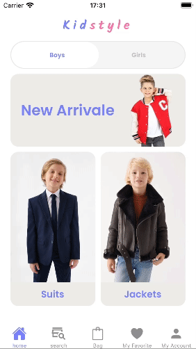
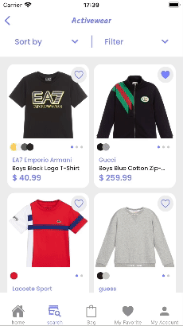
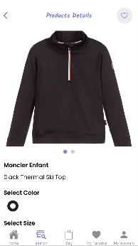
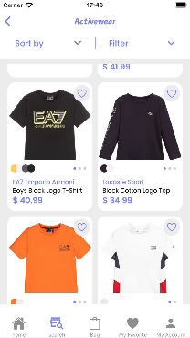
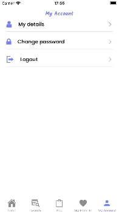

# KidStyle - Clothes for Kids

KidStyle is an online store offering a delightful collection of clothes for kids.

## Features

The KidStyle app includes the following exciting features:

### 1. Browse Categories

Users can explore a wide range of clothing categories, including tops, bottoms, dresses, suits, and more Additionally, users have the option to toggle between "Boys" and "Girls" to find clothing items for their specific needs.



### 2. Sort Products

Users can also sort the search results based on different criteria: Newest, Price High to Low, and Price Low to High.



### 3. Bag

Users can add their selected items to the shopping cart for easy checkout and purchase. The cart also displays the total cost and allows users to modify their order as needed.



### 3. Save Favorites

Users can create a wishlist of favorite items they want to save for future reference or compare before making a final decision.



### 6. Authentication

- **User Registration**: New users can easily create an account by providing their email address and setting a password.

- **User Login**: Existing users can log in securely using their registered email and password.



### 7. Account Management

The Account Management feature provides users with full control over their account settings, including:

- **User Details**: Users can change their email, first name, and last name associated with the account.

- **Change Password**: Users can update their password to a new one for enhanced security.

## Backend Information

The backend for the KidStyle app is developed using **Python** and **django** framework. The database is powered by **postgresql**. You can find the backend repository at the following link:

[Link to Backend Repository](https://github.com/fateh-kudsi-11/kidstyle-backend)

The backend handles data management, authentication, and communication with the postgresql database.

The backend is deployed on [Render](https://render.com/). However, please note that being on a free tier hosting service, there might be **occasional delays** while launching the app.

## Installation

1. Clone this repository to your local machine.

```bash
git clone https://github.com/fateh-kudsi-11/kidStyle-forntend.git
```

2. Install the required packages by navigating to the project directory and running:

```bash
npx expo install
```

3. Run the app on a simulator or physical device using the following command:

```bash
npx expo start
```

## Feedback and Contributions

We welcome your feedback and contributions to make the Kids Zone app even better! If you encounter any issues or have ideas for new features, please open an issue or submit a pull request on our GitHub repository.

## License

The KidStyle app is open-source and licensed under the [MIT License](LICENSE).
